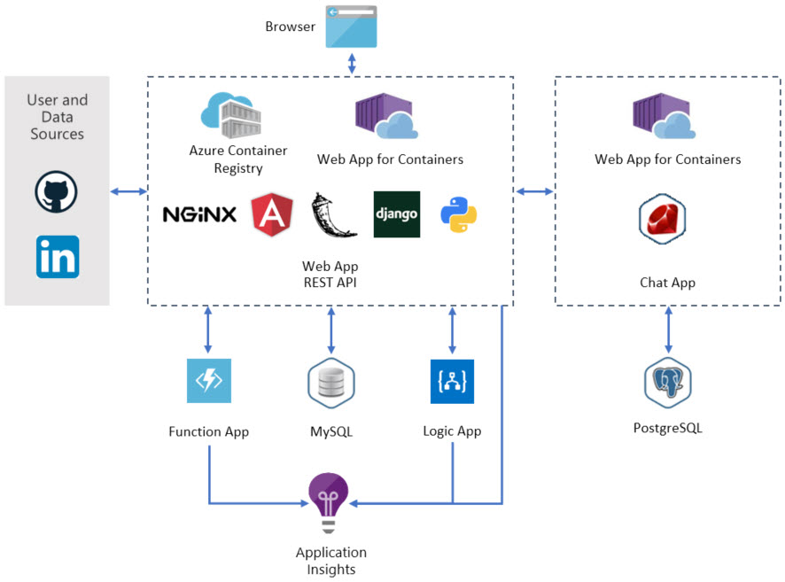

# Web App for Containers - Developer Finder

## What is Developer Finder?

The Developer Finder application is a container based application that uses Azure Web App for Containers in Azure App Services. It demonstrates how to make a web application with multiple technologies and containers. 

*There are additional steps you must perform before clicking the Deploy button.  Please refer to the [Developer Finder Documentation](https://azure-app-service.github.io/DemoApp/setup/2001/01/01/choose-a-name.html). for more details.*

   

## What does it do?

This sample includes a web application that allows users to authenticate and register with their GitHub and LinkedIn accounts, import data into their user profiles from those systems, and supplement their profile with additional information. The web application also provides users the ability to search for developers based on the information in their profile, and even suggests friends based on common profile information.

In addition to the profile and search capabilities, the web application interacts with a custom chat system that allows users to engage in chat conversation on the web site.

The entire application is packaged inside Docker containers and deployed to Microsoft Azure. In addition to the container-based apps, Azure resources such as a MySQL database, Application Insights, and other Azure services are used to implement the application. 

## Documentation

See [Developer Finder Documentation](https://azure-app-service.github.io/DemoApp).

## Disclaimer

See [License](LICENSE)