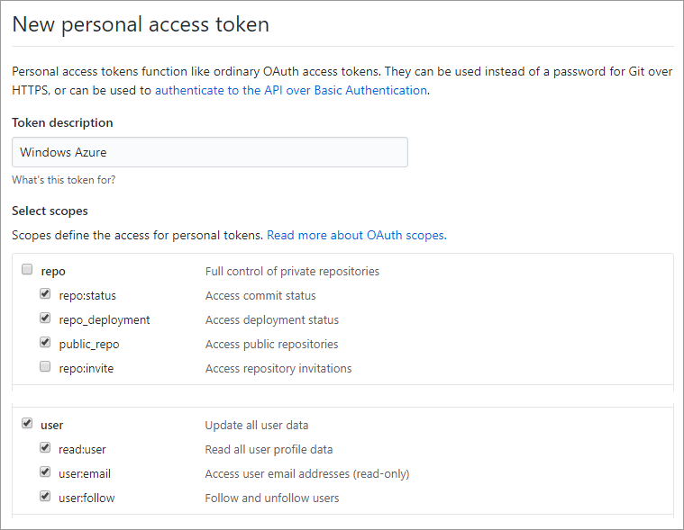

# Azure Web Application for Containers - Developer Finder

The Developer Finder application is a container based application that demonstrates how to make a web application with multiple technologies and containers.  

This sample includes a web application that allows users to authenticate and register with their GitHub and LinkedIn accounts, import data into their user profiles from those systems, and supplement their profile with additional information.  The web application also provides users the ability to search for developers based on the information in their profile, and even suggests friends based on common profile information.

In addition to the profile and search capabilities, the web application interacts with a custom chat system that allows users to engage in chat conversation on the web site.

The entire application is packaged inside Docker containers and deployed to Microsoft Azure. In addition to the container apps, Azure resources such as a MySQL database, Application Insights, and other Azure services are used to implement the application.

**Table of contents**

* [Architecture](#architecture)
  * [Web App](#web-app)
  * [Chat App](#chat-app)
  * [Azure Services](#azure-services)
  * [Databases](#databases)
* [Deployment](#deployment)
  * [Choose a name for the app](#choose-a-name-for-the-app)
  * [Register OAuth applications](#register-oauth-applications)
  * [GitHub Authorization](#github-authorization)
  * [[Optional] Register a Twilio account to send SMS](#optional-register-a-twilio-account-to-send-sms)
  * [Deploy the Azure Components](#deploy-the-azure-components)
  * [Set up the CI/CD](#set-up-the-cicd)
  * [Validate deployment](#validate-deployment)
* [Demo scenario overview and flow](#demo-scenario-overview-and-flow)
* [Running the demo](#running-the-demo)

## Architecture 

The following diagram illustrates the overall system architecture.


The main components of the application are described in subsequent sections in this document.

### Web App

#### Back-end 

The back-end is a Python (3.6) App. 

* Uses the [Flask microframework](http://flask.pocoo.org/) to implement the web app and routing.

* Uses the [Python Social Auth](https://python-social-auth.readthedocs.io/en/latest/) library to enable GitHub and LinkedIn accounts to login and returns user profile information from these systems. 

   The following path are exposed for authentication:

   | Path                                 | Description                              |
   | ------------------------------------ | ---------------------------------------- |
   | /login/*<github\|linkedin-oauth2>*   | Navigates users to GitHub/LinkedIn login page |
   | /complete/<github\|linkedin-oauth2>/ | Endpoint that handles OAuth callback     |
   | /logout                              | Logout current user                      |

* Uses [Azure Database for MySQL](https://azure.microsoft.com/en-us/services/mysql/).

* Uses [peewee](http://docs.peewee-orm.com/en/latest/) for ORM access to the MySQL Database.

* Exposes the following APIs:

   | Action | Path                    | Description                              |
   | ------ | ----------------------- | ---------------------------------------- |
   | GET    | /api/me                 | Get current user's profile               |
   | POST   | /api/me                 | Update current user's profile            |
   | GET    | /api/connected-accounts | Get current user's connected accounts    |
   | GET    | /api/friends            | Get current user's friend                |
   | POST   | /api/friends            | Add a friend for current user            |
   | GET    | /api/profiles           | Get user profiles                        |
   | GET    | /api/profiles/*<id>*    | Get a profile by id                      |
   | GET    | /api/profiles/suggested | Get suggested profiles (friends) for current user |
   | POST   | /api/sms                | Send a SMS                               |
   | GET    | /api/messages           | Get new messages sent to current user    |
   | POST   | /api/messages           | Send a message from current user         |
   | GET    | /api/messages/summary   | Get messages summary (unread count)      |

#### Font-end

The front-end is an AuglarJS App which provides the following pages:

| Page       | Path            | Description                              |
| ---------- | --------------- | ---------------------------------------- |
| Login      | /login          | Allow users to login with GitHub or LinkedIn account |
| Connect    | /connect        | Allow current user to connect to the other account |
| My Profile | /profile        | Allow current user to view and edit his/her profile |
| Search     | /search         | Allow current user to search friends, add friend, and start a chat |
| Profile    | /profile/*<id>* | Allow current user to view other devs' profile |
| Chat       | /chat/*<id>*    | Allow current user to chat with a dev or a friend |

#### Nginx 

The Nginx combines the back-end app and front-end app, and exposes them through the same port - 80.

It also works with [uwsgi](https://uwsgi-docs.readthedocs.io/en/latest/) to serve the back-end Python app.

### Chat App

The Chat App is a very simple chat back-end application implemented with Ruby-on-Rails.
It does not include an authorization/authentication module, and has no user interface.

* Built on [Ruby](https://www.ruby-lang.org/en/).
* Uses a [PostgreSQL database](https://www.postgresql.org/). 

The Ruby Chat app exposes the following APIs:

| Action | Path                                     | Description         |
| ------ | ---------------------------------------- | ------------------- |
| POST   | /api/messages                            | Send a new message  |
| GET    | /api/messages/summary?to=*<receiver_id>* | Get message summary |
| GET    | /api/messages/unread?from=*<sender_id>*&to=*<receiver_id>* | Get unread messages |

### Azure Services

Azure Services are also used to implement the application. The following services are used.

1. Function App
  * Logs custom metrics to Application Insights.
2. Logic App
  * Sends SMS text messages to users.
3. Application Insights
  * Store custom metrics for the application.

### Databases

#### MySQL Database

The MySQL Database is used by the Web App. It contains the following tables.

| Table          | Description                              |
| -------------- | ---------------------------------------- |
| user           | Stores user info, like username and email |
| usersocialauth | Stores users' connected social account info, like provider and uid<br>It contains a foreign key column user_id referencing the primary key column of the user table |
| profile        | Stores users' profiles                   |
| position       | Stores users' positions<br>It contains a foreign key column profile_id referencing the primary key column of the profile table. |
| friend         | Stores friends relationship <br>Its 2 column user_id and friend_id are foreign keys referencing the primary key column of the user table |

The **profile** table contains several columns which could be divided into 5 groups:

* Primary key:
  * id: matches the id column value in the user table.
* Values managed by My Profile page:
  * phone_number: user’s phone number.
  * skills: comma seperated string, for example: *c#, Python, Ruby*.


* Values are retrieved from GitHub and LinkedIn account:
  * company: user’s current company.
  * location: user's location.
  * name: user display name.
* Values are retrieved from GitHub only:
  * github_profile_url: the URL to user’s GitHub profile page.
  * blog_url: the URL to user's blog.
  * hireable: boolean indicating if the user is hireable.
  * bio: user's biography.
  * public_repos: the number of public repos.
  * public_gists: the number of public gists.
  * followers: the number of followers.
  * following: the number of users the user is following.
  * avatar_url: the URL to the user’s avatar.
* Values are retrieved from LinkedIn only:
  * industry: The industry the member belongs to.
  * num_connections: the number of LinkedIn connections the member has, capped at 500.  See 'num-connections-capped' to determine if the value returned has been capped.
  * num_connections_capped: returns 'true' if the member's 'num-connections' value has been capped at 500', or 'false' if 'num-connections' represents the user's true value.
  * linkedin_standard_profile_url: the URL to the member's authenticated profile on LinkedIn.  You must be logged into LinkedIn to view this URL.
  * linkedin_public_profile_url: the URL to the member's public profile on LinkedIn.

#### PostgreSQL Database

The PostgreSQL database is used by the Chat App. It is very simple and only contains 2 table:

| Table                | Description                         |
| -------------------- | ----------------------------------- |
| messages             | Stores all the messages             |
| message_read_records | Records users' last read message id |
## Deployment

### Choose a name for the app

The name of the application is 'Developer Finder'. We suggest you follow the naming convention below when creating your instance of the application:

​	**developer-finder-[suffix]**

The suffix is used to avoid Azure resource naming conflicts. It is strongly recommended you only use lowercase letters (a-z), numbers (0-9), and hyphens (-). 

Below are some examples:

* developer-finder-contoso (company name is used)
* developer-finder-0901-1200 (date and time are used)

In this document, we use the first example to show you how to deploy the solution to Azure. When you are finished with the deployment, you will be able to visit it by navigating to this URL in a web browser:

​	https://developer-finder-contoso.azurewebsites.net

### Register OAuth applications

To start, you must register OAuth applications for GitHub and LinkedIn. These OAuth applications allow the application to authenticate to GitHub and LinkedIn and download user profile information stored in these systems.

#### Register GitHub OAuth application

1. Sign into GitHub
2. Open https://github.com/settings/applications/new
3. Fill the form with the following information:

   * Application name: **Developer Finder**

   * Homepage URL: **https://developer-finder-[suffix].azurewebsites.net**

      > **Note:** Replace the **[suffix]** placeholder with the one you choose to use.  Use this same value throughout the deployment process.
      >
      > **Example:**
      >
      > 	https://developer-finder-contoso.azurewebsites.net

   * Authorization callback URL:

     **https://developer-finder-[suffix].azurewebsites.net/complete/github/**

     > **Note:** Replace the **[suffix]** placeholder with the one you choose to use.  Use this same value throughout the deployment process.
     >
     > **Example:**
     >
     > 	https://developer-finder-contoso.azurewebsites.net/complete/github/

4. Click **Register application**.
5. Copy aside the **ClientID** and **Client Secret**. 

   > Note: These values will be used for the **OAuth GitHub Client Id** and **OAuth GitHub client Secret** ARM template parameters.

#### Register LinkedIn OAuth application

1. Sign into LinkedIn.

2. Open https://www.linkedin.com/developer/apps/new

3. Fill the form with the following information:

   * Name: **Developer Finder**

   * Application Logo: download and use the image below

     

   * Website URL: **https://developer-finder-[suffix].azurewebsites.net**
      > **Note:** Replace the **[suffix]** placeholder with the one you choose to use.  Use this same value throughout the deployment process.
      >
      > **Example:**  
      >
      > ```
      > https://developer-finder-contoso.azurewebsites.net
      > ```

4. Input the other required fields, then click **Submit**.

5. Add the OAuth 2 Authorized Redirect URL: 

   **https://developer-finder-[suffix].azurewebsites.net/complete/linkedin-oauth2/**

   > **Note:** Replace the **[suffix]** placeholder with the one you choose to use.  Use this same value throughout the deployment process.
   >
   > **Example:**
   >
   > 	https://developer-finder-contoso.azurewebsites.net/complete/linkedin-oauth2/

6. Click **Update**.

7. Copy aside the **ClientID** and **Client Secret**. 

   > Note: These values will be used for the **OAuth LinkedIn Client Id** and **OAuth LinkedIn Client Secret** ARM template parameters.

### GitHub Authorization

1. Generate Token

   - Open https://github.com/settings/tokens in your web browser

   - Sign into GitHub

   - Fork this repository to your GitHub account

   - Click **Generate Token**

   - Enter a value in the **Token description** text box

   - Select the following checkboxes (your selections should match the screenshot below):

     - repo (all) -> repo:status, repo_deployment, public_repo

     - admin:repo_hook -> read:repo_hook

       

2. Add the GitHub Token to Azure in the Azure Resource Explorer

   * Open https://resources.azure.com/providers/Microsoft.Web/sourcecontrols/GitHub in your web browser.

   * Log in with your Azure account.

   * Selected the correct Azure subscription.

   * Select **Read/Write** mode.

   * Click **Edit**.

   * Paste the token into the **token parameter**.

     

   * Click **PUT**.

### [Optional] Register a Twilio account to send SMS 

When a chat started, the app will send SMS to notify the other side. In order to acheive this, we will create a trail Twillo. 

But we need to verify other others' phone numbers in advance due to the restrictions of trial account. You can skip this section.

#### Create a trial Twilio account and configure

1. Register a trail account:

   * Open https://www.twilio.com/, then click **Get a free API key**. 
   * You will be redirected to **Sign up for free page**. Fill in the form, then click **Get Started**.
   * Twilio will show a page verify you‘re a human. Finish it.

2. Create a project:

   After the human verification, you will be redirected to a page to let you create a project.

   * Input a name, for example: Developer Finder, then Click **Create Project**.

   * After the project created, copy aside the values of **ACCOUNT ID** and **AUTH TOKEN**.

     > Note: These 2 values will be used for the **Twilio Account SID** and **Twilio Auth Token** ARM template parameters.

3. Get a phone number.

   * Click the **Manage Numbers** under the **Phone Numbers** section.

   * Twilio will redirect you to **Phone Numbers Dashboard**. Click **Get Start**.

   * Click **Get you first Twilio phone number**. 

     Twilio will pre-select a phone number. Let use it. Click **Choose this number**.

     

     Copy aside the phone number.

     > Note: These phone number will be used for the **Twilio From Phone Number** ARM template parameter.

#### Verify a phone number

1. Click **Verified Caller IDs** on the **Phone Numbers page**.

   

2. Click the red **⊕**:

   

   Follow the instructions to verify the phone number.

### Deploy the Azure Components

1. In your web browser, navigate to your fork of this repository.

2. Click the **Deploy to Azure** button below:

   [](https://portal.azure.com/#create/Microsoft.Template/uri/https%3A%2F%2Fraw.githubusercontent.com%2FTylerLu%2FDeveloper-Finder%2Fmaster%2Fazuredeploy.json)

3. Fill in the values in the deployment page:

  

   * Resource group: 

     We suggest you create a new resource group and name it **DeveloperFinderRG**.

   * Location: 

     Web Apps on Linux are currently (2017/08) only available in the following regions. So, you must choose one of the regions below:

     * West US
     * East US
     * West Europe
     * North Europe
     * South Central US
     * North Central US
     * Southeast Asia
     * East Asia
     * Australia East
     * Japan East
     * Brazil South
     * South India

  

   * Web App Name: 

     Use the name you chose at the start of these instructions that follows the **developer-finder-[suffix]** naming convention.

      > **Example:** https://developer-finder-contoso.azurewebsites.net

   * No-Linux Web App Location: 

     You **MUST choose a different region for the non-Linux web apps**, because they cannot be created in the same region and the same resource group.

   * OAuth Git Hub Client Id & Secret: 

     Use the client id and secret of the GitHub OAuth app.

   * OAuth LinkedIn Client Id & Secret: 

     Use the client id and secret of the LinkedIn OAuth app.

   * Twilio Account SID & Auth Token & From Phone Number.

     Use the values you got from you Twilio account.

   * Database Admin Login Name: 

     It cannot be 'azure_superuser', 'admin', 'administrator', 'root', 'guest' or 'public'.

   * Database Admin Login Password: 

     This field should be between 8 and 128 characters long. Your password must contain characters from three of the following categories – English uppercase letters, English lowercase letters, numbers (0-9), and non-alphanumeric characters (!, $, #, %, etc.).

   * Ruby Chat Docker Image

   TODO: Need to add the path to this image.

   * Source Code Repository URL:

     Use the URL of the repository you just cloned.

4. Check **I agree to the terms and conditions stated above**.

5. Click **Purchase**.
6. Wait until the ARM template deployment process completes.

### Set up CI/CD

1. Navigate to the resource group you just created and deployed, then click the **developer-finder-[suffix]** Web App:

   

2. Click **Continous Delivery**, then click **Configure**.

   

3. Click **Choose container registry**, the pre-configured private registry will be loaded.

   

4. Click **Save** (the right one).

5. Click **Configure continuous delivery**:

   

   * Code repository: choose **GitHub**
   * Repository: choose this GitHub repository that you forked.
   * Branch: choose **master**
   * Dockerfile path: change it to **Dockerfile**

6. Click **Save **(the right one).

7. Click **Select a Team Service account**:

   

   * Create a new account or using an existing one.
   * Create a new project or using an existing one.

8. Click **Save** (the right one).

9. Click **Save**. 

   > Note: It takes a few minutes to finish:
   >
   > 

### Validate deployment

Open the http**s**://**developer-finder-[suffix]**.azurewebsites.net web app.

> Note: 
>
> 1. Make sure you use http**s** instead of http.
> 2. Make sure you replace the [suffix] placeholder with the value you have used throughout the deployment process.

You will see the login page:


> Note: If you get a "502 Bad Gateway" error, please wait for a few minutes and try again. 

## Demo scenario overview and flow

See the [Demo Script](Demo Script.pptx) slide deck.

## Running the demo

Follow the steps in [Demo Script](Demo Script.pptx) slide deck.

